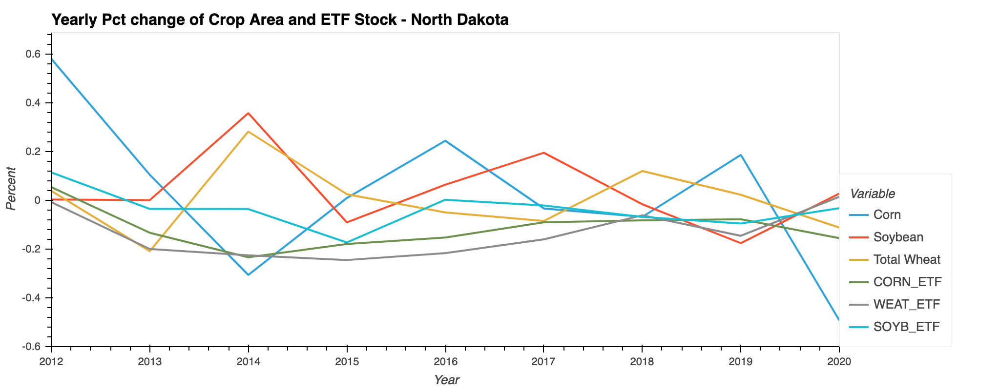

# project_1
Fintech Bootcamp Project 1

Google Earth Engine Crop Area and ETF Time Series Analysise

# Our Approach

The analysis below will showcase the changes in crop land area for 3 agricultural commodities over the last 10 years and will look for correlations with Exchange Traded Fund commodity stocks of the same type.

### 1) Setting up crop data to be visulized on the map.

Using Google Earth Map, we collected the data in order to show the crops.

The following images belows shows how the map had changed over the period of time we had collected the data.


### 2) Gather ETF Ticker data for CORN, SOYB and WHEAT.

We had imported the dataset from AgriTrieker.py to gather the ETF for Corn, Soy Beans and Wheat from the last 10 years. 

After the data collection was completed we needed to resample the imformation as the pixel data from the map is only available on a yearly basis.


### 3) Gather pixel data that represents crop land cover in the US.

Our goal in this part was to retrieve visual data using Earth Engine and breakdown the information into samples based on Years, US States and Crops 


### 4) Compare crop land area changes with ETF stock changes


### 5) Compare ETF stock changes with crop land area changes by State.





# How to set up the Google Earth Engine

### 1) Setup a new GE environment.

```shell
conda create -n geenv python=3.7 anaconda -y

conda activate geenv

```
### 2) We need to install some libraries

```shell
conda install mamba -c conda-forge

mamba install geemap -c conda-forge

mamba install jupyter_contrib_nbextensions -c conda-forge

```

### 3) And Finally run Jupyter Notebook

```shell
jupyter notebook
```
